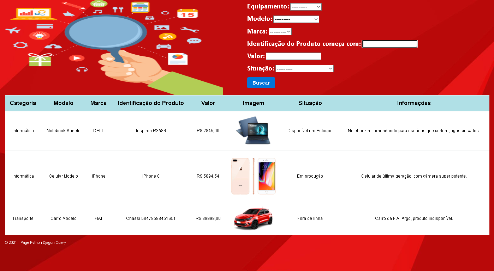

# PÁGINA DE FILTRO/BUSCA

*Utilize a página para filtrar e buscar valores dentro do banco de dados.*

## Como rodar o projeto:
1. Clone o repositório;
```
git clone https://github.com/fabriciovale20/mypage.git
```
2. Acesse a pasta do projeto;
```
cd mypage
```
3. Crie um ambiente virtual com Python 3;
```
python -m venv .venv
```
4. Ative o Virtualenv;
```
.venv\Scripts\activate
```
5. Instale as dependências;
```
pipenv install
```
6. Rode o servidor.
```
python manage.py runserver
```


